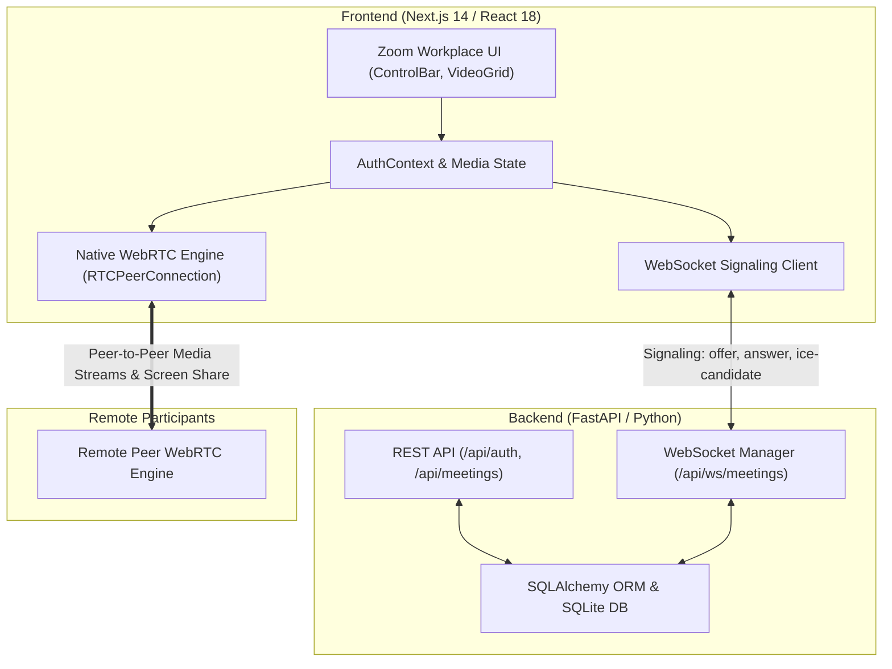
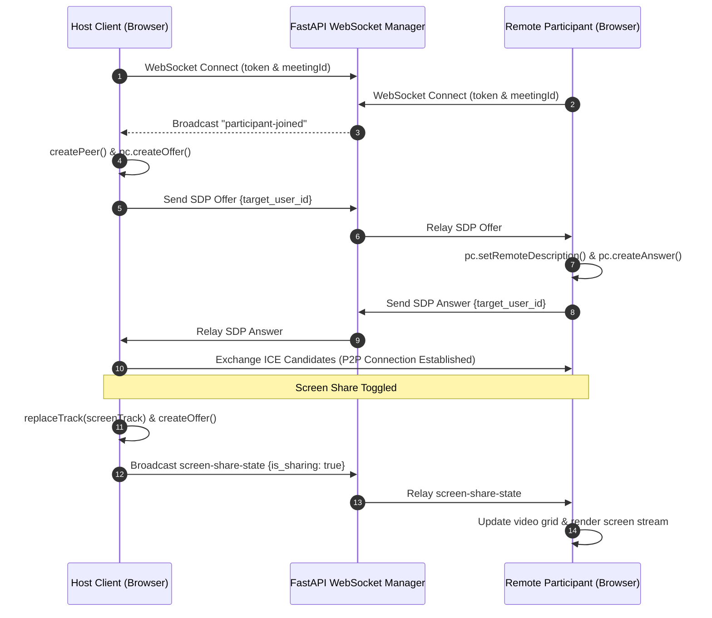

# Zoom Clone - Video Conferencing Platform

A full-stack, real-time video conferencing web application inspired by Zoom Workplace. Built with **Next.js 14**, **React**, **Tailwind CSS**, **TypeScript**, **WebRTC**, **WebSockets**, and **FastAPI**.

---

## Architecture & System Design



### WebRTC Signaling & Screen Share Sequence



---

## Tech Stack

### Frontend
- **Framework**: Next.js 14 (App Router) & React 18
- **Language**: TypeScript
- **Styling**: Tailwind CSS
- **Icons**: Lucide React
- **Real-Time Communication**: Native Browser WebRTC API (`RTCPeerConnection`, `MediaStream`, `getDisplayMedia`)

### Backend
- **Framework**: FastAPI (Python 3.10+)
- **Server**: Uvicorn (ASGI)
- **Database & ORM**: SQLite & SQLAlchemy
- **Real-Time Signaling**: WebSockets (`ws://` and `wss://`)
- **Security & Authentication**: JWT (JSON Web Tokens) with HTTP-only cookies, Passlib (Bcrypt password hashing)

---

## Features

- 🎥 **Real-time WebRTC Video Calls**: Multi-participant video & audio streaming with local video mirroring and camera/mic controls.
- 🖥️ **Screen Sharing Broadcasting**: Host/participant screen sharing relayed seamlessly via WebRTC track replacement and SDP renegotiation.
- 🎨 **Official Zoom Workplace UI**: Dark bottom control bar layout (`Audio ^`, `Video ^`, `Participants ^`, `Chat ^`, `React ^`, `Share ^`, `Host tools`, `More`, `End`).
- ⚡ **Instant & Scheduled Meetings**: Instant room generation and future meeting scheduling with unique IDs (`abc-def-ghi`).
- 🙋 **Host Management Tools**: Host capabilities to mute individual participants, mute all participants simultaneously, kick participants, and end meetings for everyone.
- 💬 **In-Meeting Real-time Chat**: Text messaging synced across all meeting room participants via WebSockets.
- 👏 **Floating Emoji Reactions**: Floating animated reaction bubbles overlay on video tiles (`👍`, `❤️`, `👏`, `😂`, `🎉`, `🔥`).
- 🔒 **Authentication & Authorization**: User registration, login, and session persistence using JWT tokens.
- 🌐 **Mixed-Content Auto-Upgrader**: Auto-upgrades WebSocket signaling URLs (`ws://` to `wss://`) on HTTPS origins (e.g., Vercel frontend deployments).

---

## Project Structure

```
zoom_clone/
├── backend/
│   ├── app/
│   │   ├── api/          # FastAPI routers (auth, meetings, ws signaling)
│   │   ├── core/         # Config and security helpers
│   │   ├── database/     # DB connection and session setup
│   │   ├── models/       # SQLAlchemy models (User, Meeting, Participant)
│   │   ├── schemas/      # Pydantic validation models
│   │   └── main.py       # FastAPI app entry point & CORS configuration
│   ├── seed.py           # Database seed script for test data
│   ├── test_backend.py   # Automated backend test suite
│   └── requirements.txt  # Python dependencies
└── frontend/
    ├── app/              # Next.js App Router pages (login, signup, dashboard, join, meeting)
    ├── components/       # Modular UI components (ControlBar, VideoGrid, Modals, Panels)
    │   ├── dashboard/    # Dashboard widgets & banners
    │   ├── meeting/      # Meeting header & reactions overlay
    │   └── ui/           # Atomic UI primitives (Modal, ControlButton)
    ├── context/          # AuthContext provider
    ├── lib/              # API fetch wrapper & WebRTC config
    └── types/            # TypeScript interfaces and unions
```

---

## Setup & Installation Instructions

### Prerequisites
- **Node.js** v18.0.0 or higher
- **npm** v9.0.0 or higher
- **Python** 3.10 or higher

---

### 1. Backend Setup

Navigate to the `backend` directory:
```bash
cd backend
```

Create and activate a Python virtual environment:
```bash
# Windows
python -m venv venv
venv\Scripts\activate

# macOS / Linux
python3 -m venv venv
source venv/bin/activate
```

Install backend dependencies:
```bash
pip install -r requirements.txt
```

*(Optional)* Seed the SQLite database with initial sample data:
```bash
python seed.py
```

Start the FastAPI development server:
```bash
uvicorn app.main:app --reload --port 8000
```
The API server will run at `http://localhost:8000`.

---

### 2. Frontend Setup

In a new terminal window, navigate to the `frontend` directory:
```bash
cd frontend
```

Install frontend dependencies:
```bash
npm install
```

Configure environment variables by creating `.env.local` inside `frontend/`:
```env
NEXT_PUBLIC_API_URL=http://localhost:8000
NEXT_PUBLIC_WS_URL=ws://localhost:8000
```

Start the Next.js development server:
```bash
npm run dev
```
The web application will run at `http://localhost:3000`.

---

### 3. Running Verification Tests

To verify backend endpoints and meeting logic:
```bash
cd backend
python test_backend.py
```

To verify frontend TypeScript compilation and production build:
```bash
cd frontend
npm run build
```

---

## Assumptions Made

1. **WebRTC Topology**: Uses a peer-to-peer Full Mesh topology suitable for small to medium-sized meeting rooms without requiring a dedicated SFU server.
2. **STUN Server Defaults**: Uses standard public Google STUN servers (`stun:stun.l.google.com:19302`) for WebRTC NAT traversal.
3. **Browser Permissions**: Requires user consent for camera and microphone media access (`navigator.mediaDevices.getUserMedia`) and screen capture (`navigator.mediaDevices.getDisplayMedia`).
4. **HTTPS / Mixed Content**: When deployed on HTTPS hosts (e.g., Vercel), WebSocket connections automatically upgrade from `ws://` to `wss://` to comply with browser security policies.